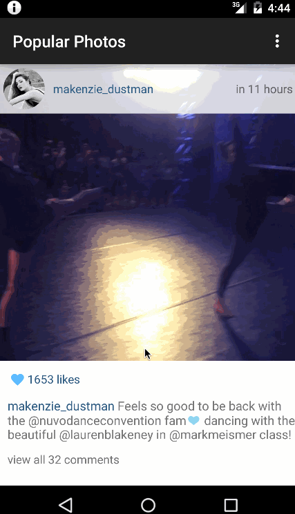

CodePath Android Project 1 - Instagram Client
=====================

This is the Instagram read-only client app built for the CodePath Android Course.

Timespent: 7 hours

Completed user stories:

* [x] Required: User can scroll through current popular photos from Instagram
* [x] Required: For each photo displayed, user can see the following details: Graphic, Caption, Username

Extensions:
* [x] Optional: Add pull-to-refresh for popular stream with SwipeRefreshLayout
* [ ] Optional: Show latest comment for each photo (bonus: show last 2 comments)
* [x] Optional: Display each photo with the same style and proportions as the real Instagram (see screens below)
* [x] Optional: Display each user profile image using a RoundedImageView
* [x] Optional: Display a nice default placeholder graphic for each image during loading (read more about Picasso)
* [ ] Optional: Improve the user interface through styling and coloring
* [ ] Optional: Show latest comment for each photo (bonus: show last 2 comments)
* [x] Bonus: Allow user to view all comments for an image within a separate activity or dialog fragment
* [ ] Bonus: Allow video posts to be played in full-screen using the VideoView

Walkthrough of all user stories:

